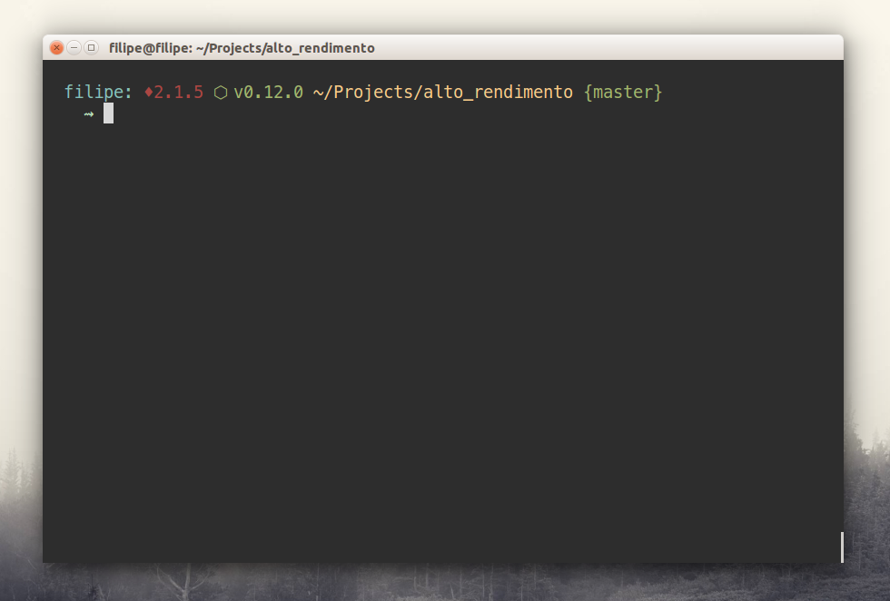
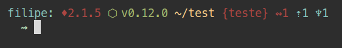
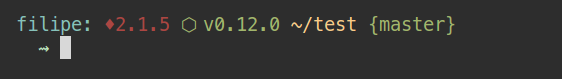

# Monroe
> Minimal and useful terminal theme



## Features
- Show the Ruby version
- Show the Node version
- Show if a branch is dirty

## Example



## Installation

#### In oh-my-zsh
1. Download it (`git clone git@github.com:filipelinhares/monroe-theme.git`)
2. Put the file **monroe.zsh-theme** in **~/.oh-my-zsh/themes/**
3. Configure the theme in your **~/.zshrc** file with this line:

```bash
ZSH_THEME="monroe"
```

## License
MIT © [Filipe Linhares](http://filipelinhares.com)
