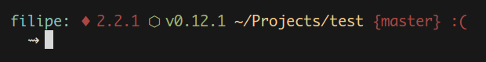

# Monroe
> Minimal and useful terminal theme


## Features
- Show the number of untracked files with ↭
- Show the number of commits unpusheds with ⇡
- Show the number of unmerged branchs with ♆
- Show the Ruby version
- Show the Node version

## Example



This project has:

`↭1` - 1 untrackef file
`⇡1` - 1 commit to push
`♆1` - 1 branch to merge

The red color of branch name, it's because the branch is dirty and the green name of the branch is because is clean.


## Installation

#### In oh-my-zsh
1. Download it here
2. Put the file **monroe.zsh-theme** in **~/.oh-my-zsh/themes/**
3. Configure the theme in your **~/.zshrc** file:

```bash
ZSH_THEME="bullet-train"
```

## Customization
You can change the variables you own to just display things wich be useful for you:

```bash
MONROE_SHOW_RUBY=true
MONROE_SHOW_NVM=true
MONROE_SHOW_UNPUSHED=true
MONROE_SHOW_UNMERGED=true
MONROE_SHOW_UNTRACKED=true
```

## License
MIT © [Filipe Linhares](http://filipelinhares.com)
