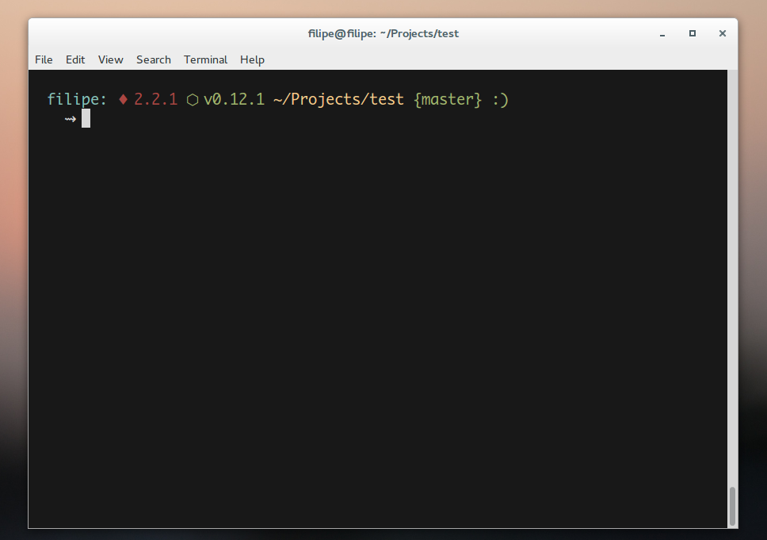
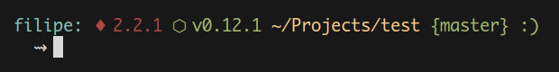

# Monroe
> Minimal and useful terminal theme



## Features
- Show the Ruby version
- Show the Node version
- Show if a branch is dirty

## Example



## Installation

#### wget
```bash
wget -O $HOME/.oh-my-zsh/themes/monroe.zsh-theme https://raw.githubusercontent.com/filipelinhares/monroe-theme/master/monroe.zsh-theme
```

#### cURL
```bash
curl https://raw.githubusercontent.com/filipelinhares/monroe-theme/master/monroe.zsh-theme > $HOME/.oh-my-zsh/themes/monroe.zsh-theme
```

## Configure
In your **~/.zshrc** file with this line:
```bash
ZSH_THEME="monroe"
```

## License
MIT © [Filipe Linhares](http://filipelinhares.com)
